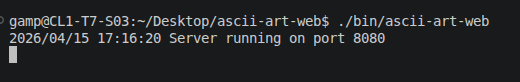
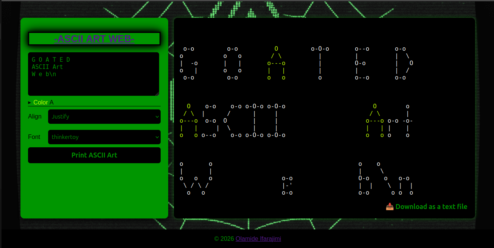

# ASCII Art Web
Ascii Art Fill is a website written in Go Language, HTML and CSS that draws the ASCII art of the ASCII text you pass to its text box. It can also color and align the text. Its output can also be downloaded as a text file.

It uses only the standard libraries of Go language. 

It uses banner files that have the art for each character arranged in the order of the ASCII table and separated by a newline.

It only works for ASCII characters. Unicode characters beyond the [ASCII table](https://www.ascii-code.com/) will cause errors.

Command characters apart from newlines will cause panics.

I hope to be able to make this program the starting point for a deterministic image generator.

## Installation
- `git clone https://github.com/Lord-lami/ascii-art-web.git`

## Usage
- Change directory to the `ascii-art-web` folder
- To run the web server
- - Run `./bin/ascii-art-web` on your terminal to launch the web interface on port 8080
- - On your browser go to http://localhost:8080/
- To run the command line interface
- - Run `./bin/ascii-art-full sample-text` on your terminal

## Demo
After running `./bin/ascii-art-web`

### Terminal

After going to http://localhost:8080/

### Browser

## Credits
- [Olamide Ifarajimi](https://acad.learn2earn.ng/git/oifaraji)

## License
Copyright © 2026

This Project is [GPL](https://www.gnu.org/licenses/gpl-3.0.en.html) Licensed